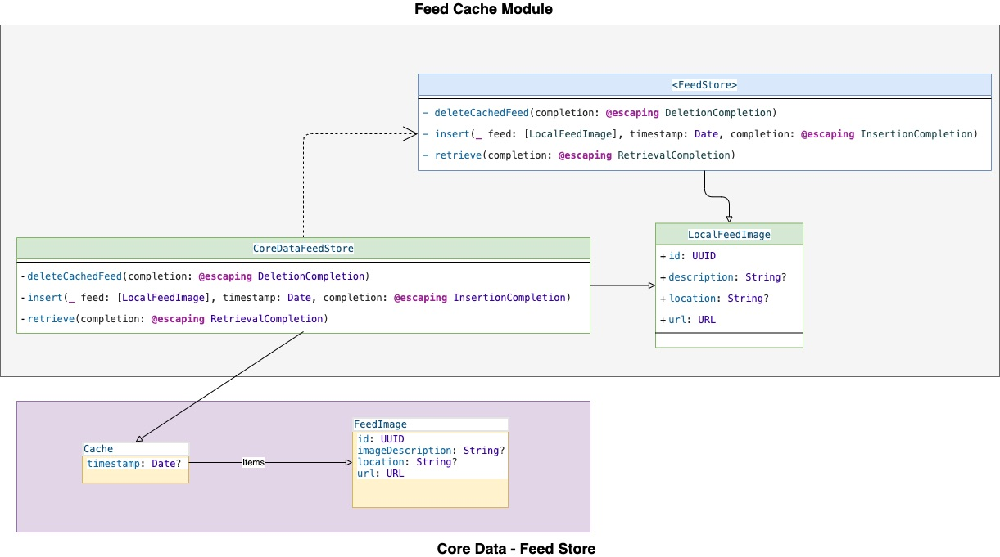

# The `FeedStore` challenge - iOSLeadEssentials.com

You are called to build your own persistence infrastructure implementation by creating a new component that conforms to the `<FeedStore>` protocol.

Your custom persistence infrastructure implementation can be backed by any persistence stack you wish, i.e. CoreData, Realm, in memory, etc, as shown in the diagram below.

## Instructions

1) Fork the latest version of this repository. Here's <a href="https://guides.github.com/activities/forking" target="_blank">how forking works</a>.

2) Implement **at least one** `<FeedStore>` implementation of your choice.

3) Use the `Tests/FeedStoreChallengeTests.swift` to validate your implementation. We recommend you to implement one test at a time. Follow the process: Make the test pass, commit, and move to the next one. In the end, all tests **must pass**. 

4) If your implementation has failable operations (e.g., it might fail to load data from disk), uncomment and implement the failable test extensions at the bottom of the `Tests/FeedStoreChallengeTests.swift` test file. 

5) If your implementation persists data to disk (e.g., CoreData/Realm), you must use the `Tests/FeedStoreIntegrationTests.swift` to check this behavior. We recommend you to implement one test at a time. Follow the process: Make the test pass, commit, and move to the next one. In the end, all tests **must pass**. 

6) When all tests are passing and you’re done implementing your `<FeedStore>` solution, create a Pull Request from your branch to the main challenge repo. Use the name of your implementation as the title for the Pull Request, for example, *"CoreData implementation - Your name"*.

## Guidelines

1) Aim to commit your changes every time you add/alter the behavior of your system or refactor your code.

2) Aim for descriptive commit messages that clarify the intent of your contribution which will help other developers understand your train of thought and purpose of changes.

3) The system should always be in a green state, meaning that in each commit all tests should be passing.

4) The project should build without warnings.

5) The code should be carefully organized and easy to read (e.g. indentation must be consistent).

6) Make careful and proper use of access control, marking as `private` any implementation details that aren’t referenced from other external components.

7) Aim to write self-documenting code by providing context and detail when naming your components, avoiding explanations in comments.

8) Aim to declare dependencies explicitly, leveraging dependency injection wherever necessary.

9) Aim **not** to block the main thread - run expensive operations in a background queue.

10) Strive to produce a clean solution as it can be **an ideal addition to your portfolio**!

Finally, add to this README file:

### Comments and remarks you think other developers will find useful.

CoreDataFeedStore as a concrete implementation of <FeedStore> protocol

### The Dependency Diagram demonstrating the architecture of your solution. 

